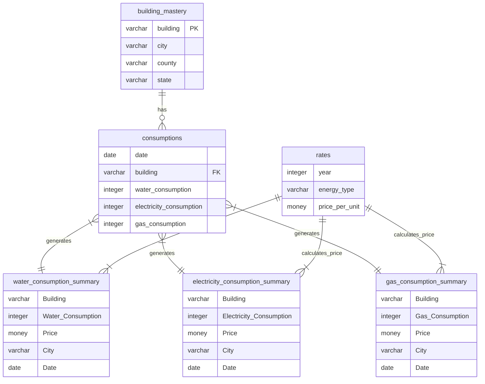

# Energy-Consumption-Dashboard-SQL-Excel

<div style="display: flex; justify-content: center; gap: 10px; flex-wrap: wrap;" align="center">
  <div style="display: flex; gap: 10px;">
    
    
  </div>
  <div style="display: flex; gap: 10px;">
    
    
  </div>
</div>

## Content
1. [Overview](#overview)
2. [Database ERD](#database-erd)
3. [Data Preparation](#data-preparation)
4. [Data Summarization](#data-summarization)
5. [Data Visualization](#data-visualization)

## Overview
This is a complete project of creating an interactive dashboard using a combination of the magic of SQL, Excel and Power Pivot. The dataset used is a real world data of the consumption of energy of 11 buildings distributed in 5 states of the USA along 4 years (2016-2019). The goal was creating a dashboard that shows a bunsh of info about the conumption of (Water, Electricity and Gas) of these buildings. **The task was to answer some question and draw some charts to visualize and summarize the data:**
- What is the total price paid per element?
- What is the total consumption per element?
- What is the ratio of consumption among buildings?
- A trend line chart of consumption.
- A column chuart of buildings consumption
- A map chart of consumption per state
## Database ERD

## Data Preparation
### 1. SQL Querying
---
Before we dive into the querying phase we have a very improtant question. **Why the use of SQL database while we can handle the data using a simple Excel workbook?**
> Well, let's suppose we have a bigger size of data that can't be handled with Excel sheets, as the total number of rows that Excel can handle is 1,044,000 rows That's not enough for big data querying, so that's why SQL databases are efficient in managing the data.  We can connect them to whatever software we use to visualize our insights, whether **Excel, Power BI, or Tableau.**  
---
1. Created a new database into my local PostgreSQL:
    ```sql
    CREATE DATABASE energy;
    ```
2. Created the three tables in the dataset and imported thier values using `COPY`,`FROM` commands:
    ```sql
    CREATE TABLE consumptions (
        date DATE,
        building VARCHAR(10),
        water_consumption INT,
        electricity_consumption INT,
        gas_consumption INT
    )
    
    COPY consumptions (date, building, water_consumption, electricity_consumption, gas_consumption)
    FROM 'C:\Mine\DEPI\Projects\Energy Consumption Dataset\consumptions.csv'
    DELIMITER ','
    CSV HEADER
    
    CREATE TABLE building_mastery (
        building VARCHAR(10) PRIMARY KEY,
        city VARCHAR(25),
        county VARCHAR(10)
    )
    
    COPY building_mastery (building, city, county)
    FROM 'C:\Mine\DEPI\Projects\Energy Consumption Dataset\building_master.csv'
    DELIMITER ','
    CSV HEADER
    
    CREATE TABLE rates (
        year INT,
        energy_type VARCHAR(50),
        price_per_unit MONEY
    )
    
    COPY rates (year, energy_type, price_per_unit)
    FROM 'C:\Mine\DEPI\Projects\Energy Consumption Dataset\rates.csv'
    DELIMITER ','
    CSV HEADER;
    -- :D
    ```
3. I had to assign the `building` column as a foreign key so I altered the table:
    ```sql
    ALTER TABLE consumptions
    ADD CONSTRAINT fk_building FOREIGN KEY (building)
    REFERENCES building_mastery (building);
    ```
4. I decided that the best way to visualize the data as ordered is to create 3 **views** that will further be imported into Excel, and they were:
- **gas_consumption_summary**
  ```sql
    CREATE VIEW gas_consumption_summary AS
    SELECT 
        building AS "Building",
        gas_consumption AS "Gas Consumption",
        CASE WHEN EXTRACT(YEAR FROM date) = g.year THEN price_per_unit * gas_consumption END AS "Price",
        city AS "City",
        date AS "Date"
    FROM consumptions
    JOIN building_mastery USING(building)
    JOIN (SELECT * FROM rates WHERE energy_type = 'Gas') AS g ON g.year = EXTRACT(YEAR FROM date);
    ```
- **electricity_consumption_summary**
  ```sql
  CREATE VIEW electricity_consumption_summary AS
  SELECT 
      building AS "Building",
      electricity_consumption AS "Electricity Consumption",
      CASE WHEN EXTRACT(YEAR FROM date) = e.year THEN price_per_unit * electricity_consumption END AS "Price",
      city AS "City",
      date AS "Date"
  FROM consumptions
  JOIN building_mastery USING(building)
  JOIN (SELECT * FROM rates WHERE energy_type = 'Electricity') AS e ON e.year = EXTRACT(YEAR FROM date);
  ```
- **water_consumption_summary**
  ```sql
  CREATE VIEW water_consumption_summary AS
  SELECT 
      building AS "Building",
      water_consumption AS "Water Consumption",
      CASE WHEN EXTRACT(YEAR FROM date) = wr.year THEN price_per_unit * water_consumption END AS "Price",
      city AS "City",
      date AS "Date"
  FROM consumptions
  JOIN building_mastery USING(building)
  JOIN (SELECT * FROM rates WHERE energy_type = 'Water') AS wr ON wr.year = EXTRACT(YEAR FROM date);
  ```
---
### 2. Setting up PostgreSQL-Excel connection
> NPGSQL provides a great environment that allows us to create a connection beween PostgreSQL and Excel with whom we can use it to easily import the data as connection (and transform it if needed using Excel Power Query).
---
### 3. Importing the data
The next mentioned steps are in Microsoft Excel:
1. **Get Data** > **FROM ODBC**.
2. Choose the connection setup in **NPGSQL**.
3. Select the views created in the sql database to be the main tables loaded into excel.
4. Load the data by pressing **load** button.
5. The data will the be loaded as connections.
---
### 4. Power Pivot and DAX
Take a look at the data in Power Pivot data model. One of the items needed can't be performed without the use of Power Pivot and DAX which is **Consumption Ratio**. So I created 3 Power Pivot measures for the 3 tables mentioned as follows:
- GasConsumptionRatio
  ```dax
  GasConsumptionRatio:=DIVIDE(
    SUM(gas_consumption_summary[Gas Consumption]),
    CALCULATE(
        SUM(gas_consumption_summary[Gas Consumption]),
        ALL(gas_consumption_summary[Building]),
        ALLSELECTED(gas_consumption_summary[Date (Year)]),
        ALLSELECTED(gas_consumption_summary[Date (Month)])
  ),0)
  ```
- ElectricitConsumptionRatio
  ```dax
  ElectricityConsumptionRatio:=DIVIDE(
      SUM(electricity_consumption_summary[Electricity Consumption]),
      CALCULATE(
          SUM(electricity_consumption_summary[Electricity Consumption]),
          ALL(electricity_consumption_summary[Building]),
          ALLSELECTED(electricity_consumption_summary[Date (Year)]),
          ALLSELECTED(electricity_consumption_summary[Date (Month)])
      ),0)
  ```
- WaterConsumptionRatio
  ```dax
  WaterConsumptionRatio:=DIVIDE(
    SUM(water_consumption_summary[Water Consumption]),
    CALCULATE(
        SUM(water_consumption_summary[Water Consumption]),
        ALL(water_consumption_summary[Building]),  -- Remove filters on Building
        ALLSELECTED(water_consumption_summary[Date (Year)]),  -- Keep slicers for Date (Year)
        ALLSELECTED(water_consumption_summary[Date (Month)])  -- Keep slicers for Date (Month)
    ),0)
  ```
---
### 5. Additional step
There was actualy an additional step while I was preparing the data. Microsoft Excel doesn't recognise the cities name to visualize them into a map chart, so I had to get back to the SQL database to setup the states names to each city mentioned in the `building_mastery`, and here's the SQL code
```sql
ALTER TABLE building_mastery
ADD COLUMN state VARCHAR(50)

UPDATE building_mastery
SET state = 
    CASE
        WHEN city = 'New York' THEN 'New York'
        WHEN city = 'Chicago' THEN 'Illinois'
        WHEN city = 'Houston' THEN 'Texas'
        WHEN city = 'Phoenix' THEN 'Arizona'
        WHEN city = 'Los Angeles' THEN 'California'
    END;
```
---
## Data Summarization
To answer the project related questions, and using the help of the connection created between Excel and PostgreSQL database it would be easy to summarize the dat using Excel Pivot Tables for the 3 tables in our database and here they are:

1. Total price paid.
  <div align="left">
      
  </div>
2. Consumption ratio.
  <div align="left">
      
  </div>
3. Consumption per Building to create the column chart as ordered.
  <div align="left">
      
  </div>
4. Consumption per State to create a chart map as ordered.
  <div align="left">
      
  </div>
5. Consumption over Time to create the trend line chart.
  <div align="left">
      
  </div>

**Using the same method, I create the same Pivot Tables for each of the created tables in the dataset**
---
## Data Visualization
Finaly, I created three customized dashboards and a main page to navigate through the dashboards pages using buttons to provide the user with suitable and customized user experience, the dashboards include:
- Buttons with icons
- Cards
- Slicers
- Trend Line
- Column Chart
- Map Chart
---
### Dasboards Linking
Using the power of **LLMs and  Prompt Engineering**, I asked the ChatGPT to create a `VBA` Code that creates **macros** that I can further assign to the shapes to navigate through the dashboards.
> The purpose of this step is to create make a good visual of the dashboard to change the theme according to what the dashboard is showing

That's that `VBA` code:
```vba
Sub GoToElectricityDashboard()
    Sheets("Electricity Dashboard").Activate
End Sub

Sub GoToWaterDashboard()
    Sheets("Water Dashboard").Activate
End Sub

Sub GoToGasDashboard()
    Sheets("Gas Dashboard").Activate
End Sub
Sub GoToMain()
    Sheets("Main").Activate
End Sub
```
### Dashboards Content
<div align="center">
Main Page
</div>
<div align="center">
  
</div>
<div align="center">
Water Conumption Dashboard
</div>
<div align="center">
  
<div align="center">
Electricity Consumption Dashboard
</div>
<div align="center">
  
</div>
<div align="center">
Gas Consumption Dashboard
</div>
<div align="center">
  
</div>
